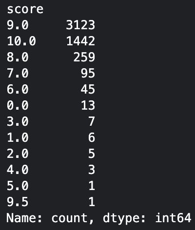
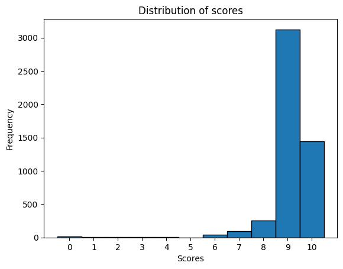
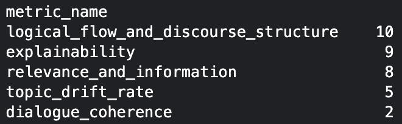
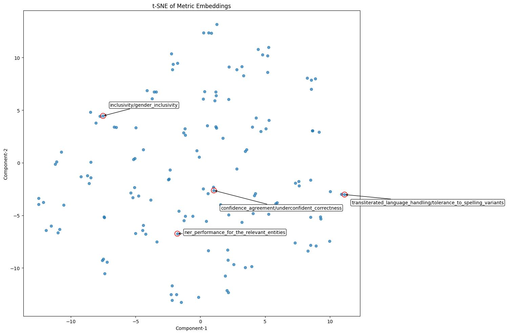
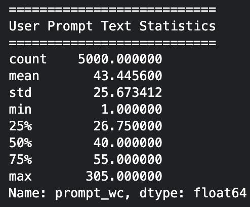
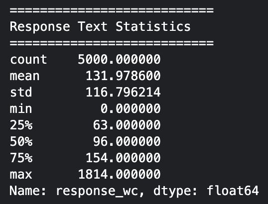
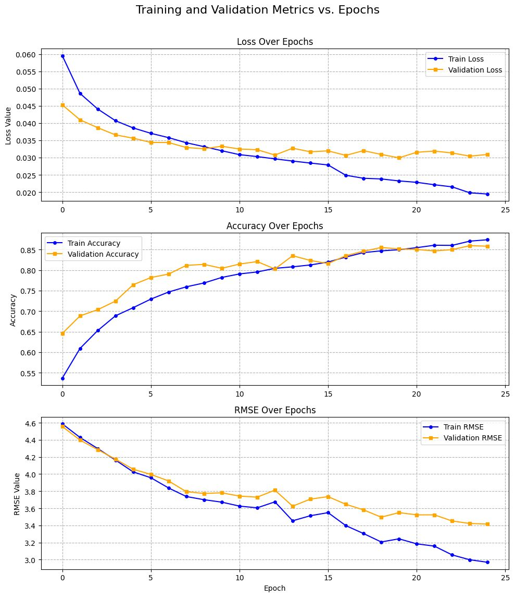

# DA5401 Kaggle Data Challenge

**Name:** Tanmay Gawande  
**Roll Number:** DA25M030

## 1. Project Overview

This Kaggle data challenge focuses on building a metric-learning model that can score how well a prompt–response pair matches a given evaluation metric.  
Instead of predicting categories, the model learns a similarity score between two inputs:  
1) a metric definition (provided only as a 768-dim embedding), and  
2) a text pair consisting of a prompt and a response.

The goal is to predict a fitness score from **0 to 10**, similar to how an LLM judge would rate the alignment between the metric and the response.

The dataset is multilingual (Tamil, Hindi, Assamese, Bengali, Bodo, Sindhi, English). Training samples include the metric name, the prompt–response texts, and the judge score. Test samples have similar structure but do not contain the score.

**Files provided**
- `metric_names.json`: list of metric names  
- `metric_name_embeddings.npy`: 145 × 768 embeddings of metric definitions  
- `train_data.json`: 5000 training samples with scores  
- `test_data.json`: ~3800 test samples without scores  

The main challenge is due to the skewed score distribution and the fact that raw metric definitions are not provided (only their embeddings) which inclines this to a metric-learning problem.


---

## 2. Data Engineering

### 2.1 Data Loading & Structure

* Columns: `metric_name`,`response`, `user_prompt`, `score`, `system_prompt` and other table with `metric_embedding`
* Data formats: loaded the `.json` objects, performed a join between **train/test dataset** and **metric_embeddings** on the key `metric_name`.
* Missing values summary: `system_prompt` for many entries was `None` (in both train and test data), and is dropped later on.
* Important columns: `metric_name`,`response`, `user_prompt`, `metric_embedding`, `score`  


### 2.2 Cleaning & Preprocessing

* The dataset had null values majorly in `system_prompt` column, so this column was dropped. Also that column had generic instructions for the LLM like _"You are a friendly and halpful chatbot..."_.
* Embedding generation using various text embedding models like `google/embeddinggemma-300m`, `l3cube-pune/indic-sentence-similarity-sbert`, `ai4bharat/IndicBERTv2-MLM-only` were used due to their ability to handle multilingual text data

### 2.3 Feature Engineering

Created binary labels, which were needed for a metric learning loss function (contrastive margin loss)  
 e.g., `score` ≥ threshold → positive pair (`1`), (threshold score like 5, 7, etc..)

---

## 3. Sampling Strategy

### 3.1 Train - Validation Split
* Train validation ratio chosen as `0.1`
* Stratification based on `label` column created in [feature engineering](#2.3-feature-engineering) to maintain train - val label distribution

### 3.2 Synthetic Sampling / Hard Negatives

The score distribution was highly skewed toward high scores, so the binary labels (`label`) became imbalanced. Contrastive learning needs enough negative examples to work well; otherwise, the model doesn't learn what a mismatched pair looks like. To fix this, we added hard negatives by pairing each metric with prompt-responses taken from other metrics, ensuring a better positive–negative ratio for training.


**Construction approach:**
- For every (metric, prompt-response) pair, select **responses belonging to other metrics** as negative examples.
- Keeping the metric fixed, we replace it's corresponding prompt-response text pair with a prompt-response text pair from a different metric.
- Label these as **0 (dissimilar)** pairs.

**Sampling ratio:**
Per sample  4 negative responses drawn from other metrics.


### 3.3 Sampling Summary Table

| Type                      | Count | Description                              |
| ------------------------- | ----- | ---------------------------------------- |
| Original positive samples |   4920    | score ≥ 7                                |
| Original negatives        |   80    | score < 7                                |
| Synthetic negatives  |    20000   | created by sampling mismatched prompt-response pairs |
| Total                     |   25000    |                                          |

---

## 4. Exploratory Data Analysis (EDA)

### 4.1 Distribution of Scores

<!-- {width=50%} -->




### 4.2 Metric Frequency Analysis and Visualization

**Top-k popular metrics (k=5)**


**Rare metrics**  


**Metrics visualized in embedding space via t-SNE**


### 4.3 Prompt and Response Text Stats






---

## 5. Model Selection

I initially experimented with classical ML models like linear regression, SVR, XGBoost but I did not get good performance.

### 5.1 Model Architecture and Loss Function

Used `l3cube-pune/indic-sentence-similarity-sbert` sentence transformer model to create response and user prompt embeddings.  

**Model**:
  * Response embedding dim: 768
  * User Prompt embedding dim: 768
  * Metric embedding dim: 768
  * Concatenate these 3 embeddings
  * Feed Forward Layers: 1024 -> 512 -> 256 -> 128 -> 1
  * Activation: LeakyReLU (avoids dead ReLU issues)
  * Output: Similarity ∈ [0,1] (sigmoid)  

**Optimizer**: AdamW  
**Learning rate Scheduler:** ReduceLROnPlateau  

**Loss: Contrastive Margin Loss**
$$ L(W, Y) = (Y)*\frac{1}{2}\left(D_{W}\right)^{2} + (1-Y)*\frac{1}{2}\left\{\max(0, m - D_{W})\right\}^{2} $$
**Y** is binary similarity label, **1** for similar pair **0** for dissimilar pair. **$D_W$** is distance learned between the embeddings. We use **$D_W$ = 1 − $model_{output}$** ($model_{output}$ is the similarity score so 1 − $model_{output}$ acts like distance). **m** is contrastive margin. Dissimilar pairs should be at least m apart.
<!-- **u, v** the two input embeddings, **u** is metric embedding  and **v** is concatenated prompt-response embedding.   -->
The model learns a distance between them.  
**Intuition:** For similar metric, prompt-response pair, loss forces the the model to give higher similarity score for similar pairs (Y=1), while loss forces model to give lower score/increase distance atleast m away for dissimilar pairs (Y=0).

### 5.2 Architecture Decisions

I experimented with two main approaches:

1. **Concatenating metric, prompt, and response embeddings** and training the model end-to-end with a contrastive objective.  
2. **Using only metric–response concatenation** with contrastive loss.

The first approach was more complex and seemed to require a deeper network (likely with stronger regularization or skip connections). In practice, the simpler metric–response setup performed better and was more stable, so I adopted that as the final architecture.

---

## 6. Performance Metrics

### 6.1 Train / Validation Performance




### 6.2 Best Epoch Summary

```
Best epoch:  20
Validation Loss:  0.029933
Validation Accuracy:  0.8516
Validatoin RMSE: 3.549444
```

---

## 7. Hacks & Workarounds

* Rounding up of predictions since the score was discretised.
* Random Negative mining to generate low score / negative label examples. 

---

## 8. Test Set Evaluation


**Public Score: 2.382**  
**Private Score: 2.387**

_This suggests that the test distribution might be multimodal_

---


# Conclusion

* The model above gave best performance.
* Limitations - it was unable to fully use the `user_prompt` embeddings.
* Future improvements - Make a deeper network with skip connections, and also include the `user_prompt` and using the [Online](https://sbert.net/docs/package_reference/sentence_transformer/losses.html#onlinecontrastiveloss) version of Contrastive Loss.

---

